# Capítulo 2 - Programming Exercises

###  2.1 (Convert Celsius to Fahrenheit) Write a program that reads a Celsius degree in a ``double`` value from the console, then converts it to Fahrenheit, and displays the result. The formula for the conversion is as follows:

Here is sample run:

-----

###  2.2 (Compute the volume of a cylinder) Write a program that reads in the radius and length of a cylinder and computes the area and volume using the following formulas:

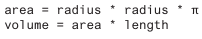

Here is a sample run:

---

###  2.3 (Convert feet into meters) Write a program that reads a number in feet, converts it to meters, and displays the result. One foot is ``0.305`` meter.

Here is a sample run:

---

###  2.4 (Convert pounds into kilograms) Write a program that converts pounds into kilograms. The program prompts the user to enter a number in pounds, converts it to kilograms, and displays the result. One pound is ``0.454`` kilogram.

Here is a sample run:

---

###  *2.5 (Financial application: calculate tips) Write a program that reads the subtotal and the gratuity rate, then computes the gratuity and total. For example, if the user enters ``10`` for subtotal and ``15%`` for gratuity rate, the program displays ``$1.5`` as gratuity and ``$11.5`` as total.

Here is a sample run:

---

###  **2.6 (Sum the digits in an integer) Write a program that reads an integer between ``0`` and ``1000`` and adds all the digits in the integer. For example, if an integer is ``932``, the sum of all its digits is ``14``.

Hint: Use the % operator to extract digits, and use the / operator to remove the extracted digit. For instance, ``932 % 10 = 2`` and ``932 / 10 = 93``.

Here is a sample run:

---

### *2.7 (Find the number of years) Write a program that prompts the user to enter the minutes (e.g., 1 billion), and displays the maximum number of years and remaining days for the minutes. For simplicity, assume that a year has ``365`` days.

Here is a sample run:

----

###  *2.8 (Current time) Listing 2.7, ShowCurrentTime.java, gives a program that displays the current time in GMT. Revise the program so it prompts the user to enter the time zone offset to GMT and displays the time in the specified time zone.

#### Listing 2.7 : 

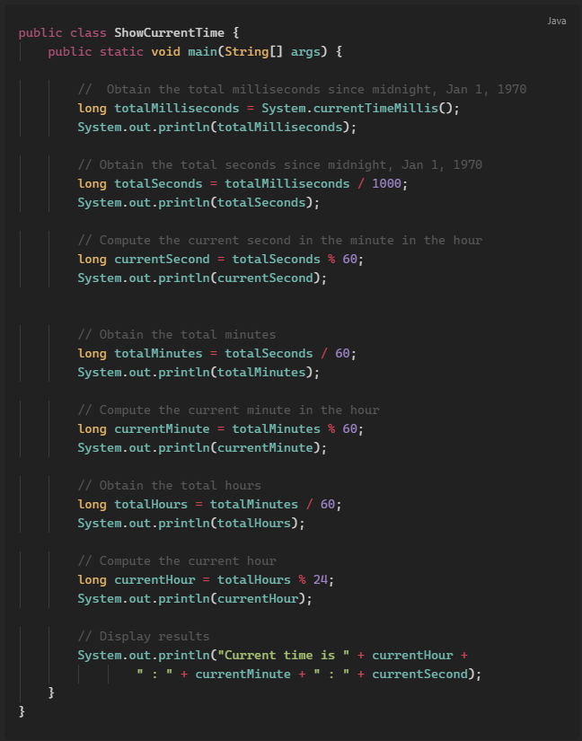

Here is a sample run:

----

###  2.9 (Physics: acceleration) Average acceleration is defined as the change of velocity divided by the time taken to make the change, as given by the following formula:

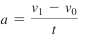

Write a program that prompts the user to enter the starting velocity v0 in meters/second, the ending velocity v1 in meters/second, and the time span t in seconds, then displays the average acceleration.

Here is a sample run:

----

###  2.10 (Science: calculating energy) Write a program that calculates the energy needed to heat water from an initial temperature to a final temperature. Your program should prompt the user to enter the amount of water in kilograms and the initial and final temperatures of the water. The formula to compute the energy is:

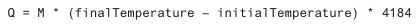

where ``M`` is the weight of water in kilograms, initial and final temperatures are in degrees Celsius, and energy ``Q`` is measured in joules. 

Here is a sample run:

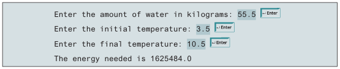

----

###  2.11 (Population projection) Rewrite Programming Exercise 1.11 to prompt the user to enter the number of years and display the population after the number of years. Use the hint in Programming Exercise 1.11 for this program. 

Here is a sample run of the program:

---

###  2.12 (Physics: finding runway length) Given an airplane’s acceleration a and take-off speed v, you can compute the minimum runway length needed for an airplane to take off using the following formula:

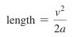

Write a program that prompts the user to enter v in meters/second (m/s) and the acceleration a in meters/second squared (m/s2), then, displays the minimum 
runway length.

----

###  **2.13 (Financial application: compound value) Suppose you save ``$100`` each month into a savings account with an annual interest rate of 5%. Thus, the monthly interest rate is 0.05/12 = 0.00417.

- After the first month, the value in the account becomes
    - 100 * (1 + 0.00417) = 100.417

- After the second month, the value in the account becomes
    - (100 + 100.417) * (1 + 0.00417) = 201.252

- After the third month, the value in the account becomes
    - (100 + 201.252) * (1 + 0.00417) = 302.507
 and so on.

Write a program that prompts the user to enter a monthly saving amount and displays the account value after the sixth month. (In Programming Exercise 5.30, you will use a loop to simplify the code and display the account value for any month.)

---

###  *2.14 (Health application: computing BMI) Body Mass Index (BMI) is a measure of health on weight. It can be calculated by taking your weight in kilograms and dividing, by the square of your height in meters. Write a program that prompts the user to enter a weight in pounds and height in inches and displays the BMI. Note one pound is 0.45359237 kilograms and one inch is 0.0254 meters. 

Here is a sample run:

---

###  2.15 (Geometry: distance of two points) Write a program that prompts the user to enter two points ``(x1, y1)`` and ``(x2, y2)`` and displays their distance. The formula for computing the distance is:

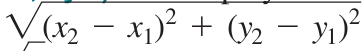

Note you can use ``Math.pow(a, 0.5)`` to compute ✓a.

Here is a sample run:

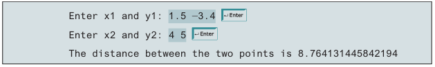

----

###  2.16 (Geometry: area of a hexagon) Write a program that prompts the user to enter the side of a hexagon and displays its area. The formula for computing the area of a hexagon is:

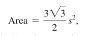

where s is the length of a side. 

Here is a sample run:

----

###  *2.17 (Science: wind-chill temperature) How cold is it outside? The temperature alone is not enough to provide the answer. Other factors including wind speed, relative humidity, and sunshine play important roles in determining coldness outside. In 2001, the National Weather Service (NWS) implemented the new wind-chill temperature to measure the coldness using temperature and wind speed. The formula is

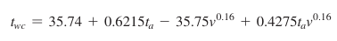

where Ta is the outside temperature measured in degrees Fahrenheit, v is the speed measured in miles per hour, and Twc is the wind-chill temperature. The formula cannot be used for wind speeds below 2 mph or temperatures below -58°F or above 41°F.

Write a program that prompts the user to enter a temperature between -58°F and 41°F and a wind speed greater than or equal to ``2`` then displays the wind-chill temperature. 

Use ``Math.pow(a, b)`` to compute v^0.16. 

Here is a sample run:

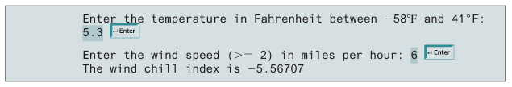

-----

### 2.18 (Print a table) Write a program that displays the following table. Cast floating-point numbers into integers.

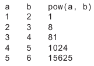

---

### *2.19 (Geometry: area of a triangle) Write a program that prompts the user to enter three points, ``(x1, y1)``, ``(x2, y2)``, and ``(x3, y3)``, of a triangle then displays its area. The formula for computing the area of a triangle is

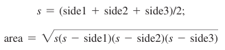

Here is a sample run:

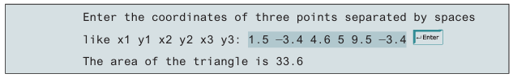

---

### *2.20 (Financial application: calculate interest) If you know the balance and the annual percentage interest rate, you can compute the interest on the next monthly payment using the following formula:

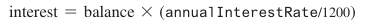

Write a program that reads the balance and the annual percentage interest rate and displays the interest for the next month. 

Here is a sample run:

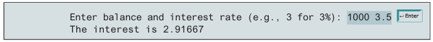

---

### *2.21 (Financial application: calculate future investment value) Write a program that reads in investment amount, annual interest rate, and number of years and displays the future investment value using the following formula:

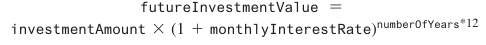

For example, if you enter amount ``1000``, annual interest rate ``3.25%``, and number of years ``1``, the future investment value is ``1032.98``.

Here is a sample run:

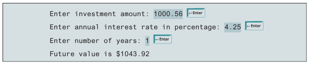

---

###  *2.22 (Financial application: monetary units) Rewrite Listing 2.10, ComputeChange.java, to fix the possible loss of accuracy when converting a ``double`` value to an int value. Enter the input as an integer whose last two digits represent the cents. For example, the input ``1156`` represents ``11`` dollars and ``56`` cents.

#### Listing 2.10:
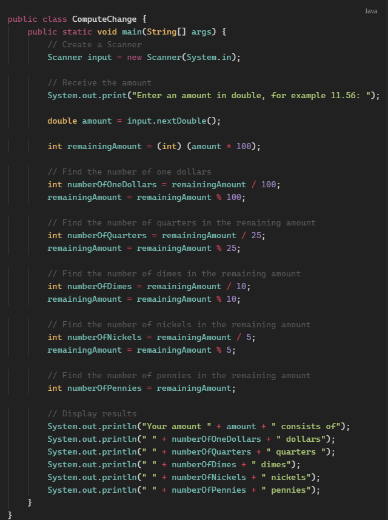

----

### *2.23 (Cost of driving) Write a program that prompts the user to enter the distance to drive, the fuel efficiency of the car in miles per gallon, and the price per gallon then displays the cost of the trip. 

Here is a sample run:

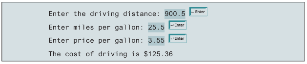

