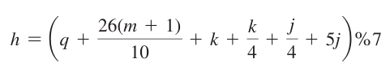

# Capítulo 3 - Programming Exercises

### *3.1 (Algebra: solve quadratic equations) The two roots of a quadratic equation ax^2 + bx + c = 0 can be obtained using the following formula:

b^2- 4ac is called the discriminant of the quadratic equation. If it is positive, the equation has two real roots. If it is zero, the equation has one root. If it is negative, the equation has no real roots.

Write a program that prompts the user to enter values for a, b, and c and displays the result based on the discriminant. If the discriminant is positive, display two roots. If the discriminant is 0, display one root. Otherwise, display “The equation has no real roots.”

Note you can use `Math.pow(x, 0.5)` to compute √x. 

Here are some sample runs:

---

### 3.2 (Game: add three numbers) The program in Listing 3.1, AdditionQuiz.java, generates two integers and prompts the user to enter the sum of these two integers. 

Revise the program to generate three single-digit integers and prompt the user to enter the sum of these three integers.

---

###  *3.3 (Algebra: solve 2 * 2 linear equations) A linear equation can be solved using Cramer’s rule given in Programming Exercise 1.13. 

Write a program that prompts the user to enter a, b, c, d, e, and f and displays the result. If ad- bc is 0, report that “The equation has no solution.”

---

### **3.4 (Random month) Write a program that randomly generates an integer between 1 and 12 and displays the English month names January, February, . . . , December for the numbers 1, 2, . . . , 12, accordingly.

---

###  *3.5 (Find future dates) Write a program that prompts the user to enter an integer for today’s day of the week (Sunday is 0, Monday is 1, . . . , and Saturday is 6). 

Also prompt the user to enter the number of days after today for a future day and display the future day of the week. 

Here is a sample run:

---

### *3.6 (Health application: BMI) Revise Listing 3.4, ComputeAndInterpretBMI.java, to let the user enter weight, feet, and inches. 

For example, if a person is 5 feet and 10 inches, you will enter 5 for feet and 10 for inches. 

Here is a sample run:

---

###  3.7 (Financial application: monetary units) Modify Listing 2.10, ComputeChange. 

Java, to display the nonzero denominations only, using singular words for single units such as 1 dollar and 1 penny, and plural words for more than one unit such as 2 dollars and 3 pennies.

---

### *3.8 (Sort three integers) Write a program that prompts the user to enter three integers and display the integers in non-decreasing order.

---

### **3.9 (Business: check ISBN-10) An ISBN-10 (International Standard Book Number) consists of 10 digits:   The last digit, d10, is a checksum, which is calculated from the other 9 digits using the following formula:

If the checksum is `10`, the last digit is denoted as X according to the ISBN-10 convention. Write a program that prompts the user to enter the first 9 digits and displays the 10-digit ISBN (including leading zeros). 

Your program should read the input as an integer. 

Here are sample runs:

---

###  3.10 (Game: addition quiz) Listing 3.3, SubtractionQuiz.java, randomly generates a subtraction question. Revise the program to randomly generate an addition question with two integers less than 100.

---

### *3.11 (Find the number of days in a month) Write a program that prompts the user to enter the month and year and displays the number of days in the month. 

For example, if the user entered month `2` and year `2012`, the program should display that February 2012 has 29 days. If the user entered month 3 and year `2015`, the program should display that March `2015` has 31 days.

---

### 3.12 (Palindrome integer) Write a program that prompts the user to enter a three-digit integer and determines whether it is a palindrome integer. 

An integer is palindrome if it reads the same from right to left and from left to right. A negative integer is treated the same as a positive integer.

Here are sample runs of this program:

---

### *3.13 (Financial application: compute taxes) Listing 3.5, ComputeTax.java, gives the source code to compute taxes for single filers. 

Complete this program to compute taxes for all filing statuses.

---

### 3.14 (Game: heads or tails) Write a program that lets the user guess whether the flip of a coin results in heads or tails. The program randomly generates an integer 0 or 1, which represents head or tail. 

The program prompts the user to enter a guess, and reports whether the guess is correct or incorrect.

---

###  **3.15 (Game: lottery) Revise Listing 3.8, Lottery.java, to generate a lottery of a three digit integer. The program prompts the user to enter a three-digit integer and determines whether the user wins according to the following rules:

 1. If the user input matches the lottery number in the exact order, the award is 
$10,000.
 2. If all digits in the user input match all digits in the lottery number, the award 
is $3,000.
 3. If one digit in the user input matches a digit in the lottery number, the award 
is $1,000.

---

### 3.16 (Random point) Write a program that displays a random coordinate in a rectangle. 

The rectangle is centered at (0, 0) with width 100 and height 200.

---

### *3.17 (Game: scissor, rock, paper) Write a program that plays the popular scissorrock–paper game. (A scissor can cut a paper, a rock can knock a scissor, and a paper can wrap a rock.) 

The program randomly generates a number 0, 1, or 2 representing scissor rock, and paper. 

The program prompts the user to enter a number 0, 1, or 2 and displays a message indicating whether the user or the computer wins, loses, or draws. 

Here are sample runs:

---

### *3.18 (Cost of shipping) A shipping company uses the following function to calculate the cost (in dollars) of shipping based on the weight of the package (in pounds).

Write a program that prompts the user to enter the weight of the package and 
displays the shipping cost. 

If the weight is negative or zero, display a message “Invalid input.” 

If the weight is greater than 20, display a message “The package cannot be shipped.”

---

### **3.19 (Compute the perimeter of a triangle) Write a program that reads three edges for a triangle and computes the perimeter if the input is valid.

Otherwise, display that the input is invalid. The input is valid if the sum of every pair of two edges is greater than the remaining edge.

---

### *3.20 (Science: wind-chill temperature) Programming Exercise 2.17 gives a formula to compute the wind-chill temperature. The formula is valid for temperatures in the range between -58°F and 41°F and wind speed greater than or equal to 2.

Write a program that prompts the user to enter a temperature and a wind speed. 

The program displays the wind-chill temperature if the input is valid; otherwise, it displays a message indicating whether the temperature and/or wind speed is invalid.

---

###  **3.21 (Science: day of the week) Zeller’s congruence is an algorithm developed by Christian Zeller to calculate the day of the week. The formula is

where

- `h` is the day of the week (0: Saturday, 1: Sunday, 2: Monday, 3: Tuesday, 4: Wednesday, 5: Thursday, and 6: Friday).

- `q` is the day of the month.

- `m` is the month (3: March, 4: April, ..., 12: December). January and February are counted as months 13 and 14 of the previous year.
 
- `j` is year/100.

- `k` is the year of the century (i.e., year % 100).

Note all divisions in this exercise perform an integer division. Write a program that prompts the user to enter a year, month, and day of the month, and displays the name of the day of the week. 

Here are some sample runs:

---

### **3.22 (Hint: January and February are counted as 13 and 14 in the formula, so you need to convert the user input 1 to 13 and 2 to 14 for the month and change the year to the previous year. 

For example, if the user enters 1 for `m` and 2015 for year, ``m`` will be 13 and `year` will be 2014 used in the formula.)

### (Geometry: point in a circle?) Write a program that prompts the user to enter a point (x, y) and checks whether the point is within the circle centered at (0, 0) with radius 10. 

For example, (4, 5) is inside the circle and (9, 9) is outside the circle, as shown in Figure 3.7a.

(Hint: A point is in the circle if its distance to (0, 0) is less than or equal to 10. The formula for computing the distance is  Test your program to cover all cases.) 

Two sample runs are shown below:

---

Figure 3.7:

### **3.23  (Geometry: point in a rectangle?) Write a program that prompts the user to enter a point `(x, y)` and checks whether the point is within the rectangle centered at `(0, 0)` with width 10 and height 5. For example, `(2, 2)` is inside the rectangle and `(6, 4)` is outside the rectangle, as shown in Figure 3.7b. 

(Hint: A point is in the rectangle if its horizontal distance to `(0, 0)` is less than or equal to `10 / 2` and its vertical distance to `(0, 0)` is less than or equal to `5.0 / 2`. 

Test your program to cover all cases.) 

Here are two sample runs:

---

### **3.24  (Game: pick a card) Write a program that simulates picking a card from a deck of 52 cards. Your program should display the rank (Ace, 2, 3, 4, 5, 6, 7, 8, 9, 10, Jack, Queen, King) and suit (Clubs, Diamonds, Hearts, Spades) of the card. 

Here is a sample run of the program:

---

### *3.25 (Geometry: intersecting point) Two points on line 1 are given as `(x1, y1)` and `(x2, y2)` and on line 2 as `(x3, y3)` and `(x4, y4)`, as shown in Figure 3.8a and b.

The intersecting point of the two lines can be found by solving the following linear equations:

This linear equation can be solved using Cramer’s rule (see Programming 
Exercise  3.3). If the equation has no solutions, the two lines are parallel (see Figure 3.8c). 

Write a program that prompts the user to enter four points and dis
plays the intersecting point.

Here are sample runs:

---

###  3.26 (Use the `&&,` ``||``, and ``^`` operators) Write a program that prompts the user to enter an integer and determines whether it is divisible by 5 and 6, whether it is divisible by 5 or 6, and whether it is divisible by 5 or 6, but not both. 

Here is a sample run of this program:

---

###  ** 3.27 (Geometry: points in triangle?) Suppose a right triangle is placed in a plane as shown below. The right-angle point is placed at (0, 0), and the other two points are placed at (200, 0) and (0, 100). 

Write a program that prompts the user to enter a point with x- and y-coordinates and determines whether the point is inside the triangle.

Here are the sample runs:

---

###  **3.28  (Geometry: two rectangles) Write a program that prompts the user to enter the center x-, y-coordinates, width, and height of two rectangles and determines whether the second rectangle is inside the first or overlaps with the first, as shown in Figure 3.9. 

Test your program to cover all cases.

Here are the sample runs:

---

###  **3.29  (Geometry: two circles) Write a program that prompts the user to enter the center coordinates and radii of two circles and determines whether the second circle is inside the first or overlaps with the first, as shown in Figure 3.10. 

(Hint: circle2 is inside circle1 if the distance between the two centers <= r1 − r2 and circle2 overlaps circle1 if the distance between the two centers <= r1 + r2. Test your program to cover all cases.)

Here are the sample runs:

---

### *3.30 (Current time) Revise Programming Exercise 2.8 to display the hour using a 12-hour clock. 

Here is a sample run:

---

###  *3.31 (Financials: currency exchange) Write a program that prompts the user to enter the exchange rate from currency in U.S. dollars to Chinese RMB. Prompt the user to enter 0 to convert from U.S. dollars to Chinese RMB and 1 to convert from Chinese RMB to U.S. dollars.

Prompt the user to enter the amount in U.S. dollars or Chinese RMB to convert it to Chinese RMB or U.S. dollars, respectively. 

Here are the sample runs:

---

### *3.32 (Geometry: point position) Given a directed line from point p0(x0, y0) to p1(x1, y1), you can use the following condition to decide whether a point p2(x2, y2) is on the left of the line, on the right, or on the same line (see Figure 3.11):

Write a program that prompts the user to enter the three points for p0, p1, and p2 and displays whether p2 is on the left of the line from p0 to p1, to the right, or on the same line. 

Here are some sample runs:

---

###  *3.33 (Financial: compare costs) Suppose you shop for rice in two different packages. You would like to write a program to compare the cost. The program prompts the user to enter the weight and price of each package and displays the one with the better price. 

Here is a sample run:

---

### *3.34 (Geometry: point on line segment) Exercise 3.32 shows how to test whether a point is on an unbounded line. Revise Exercise 3.32 to test whether a point is on a line segment. 

Write a program that prompts the user to enter the three points for p0, p1 and p2 and displays whether p2 is on the line segment from p0 to p1.

Here are some sample runs:

---
