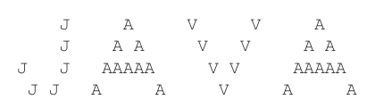
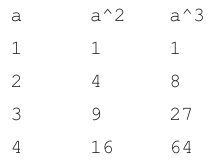
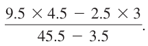
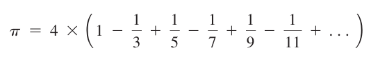
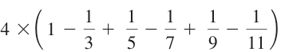
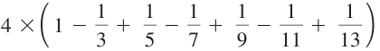
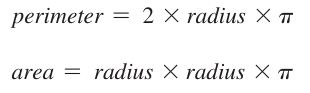
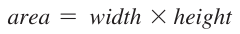
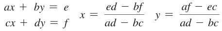
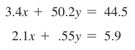

# Chapter 1 - Programming Exercises

---

## 1.1 (Display three messages) Write a program that displays Welcome to Java, Welcome to Computer Science, and Programming is fun.

---

## 1.2 (Display five messages) Write a program that displays Welcome to Java five times.

---

## *1.3 (Display a pattern) Write a program that displays the following pattern:

---

## 1.4 (Print a table) Write a program that displays the following table:

---

## 1.5 (Compute expressions) Write a program that displays the result of:

---

## 1.6 (Summation of a series) Write a program that displays the result of:
    1+ 2+ 3+ 4+ 5+ 6+ 7+ 8+ 9.

---

## 1.7 (Approximate p) p can be computed using the following formula:

Write a program that displays the result of: 

 and 

Use 1.0 instead of 1 in your program.

---

## 1.8 (Area and perimeter of a circle) Write a program that displays the area and perimeter of a circle that has a radius of 5.5 using the following formulas:

---

## 1.9 (Area and perimeter of a rectangle) Write a program that displays the area and perimeter of a rectangle with a width of 4.5 and a height of 7.9 using the following formula:

---

## 1.10 (Average speed in miles) Assume that a runner runs 14 kilometers in 45 minutes and 30 seconds. Write a program that displays the average speed in miles per hour. (Note 1 mile is equal to 1.6 kilometers.)

---

## *1.11 (Population projection) The U.S. Census Bureau projects population based on the following assumptions:
 
- One birth every 7 seconds
- One death every 13 seconds
- One new immigrant every 45 seconds

Write a program to display the population for each of the next five years. Assume that the current population is 312,032,486, and one year has 365 days. 
Hint: In Java, if two integers perform division, the result is an integer. The fractional part is truncated. 
For example, 5 / 4 is 1 (not 1.25) and 10 / 4 is 2 (not 2.5). 

To get an accurate result with the fractional part, one of the values involved in the division must be a number with a decimal point. 
For example, 5.0 / 4 is 1.25 and 10 / 4.0 is 2.5.

---

## 1.12 (Average speed in kilometers) Assume that a runner runs 24 miles in 1 hour, 40 minutes, and 35 seconds. Write a program that displays the average speed in kilometers per hour. (Note 1 mile is equal to 1.6 kilometers.)

---

## *1.13 (Algebra: solve 2 * 2 linear equations) You can use Cramer’s rule to solve the following 2 * 2 system of linear equation provided that ad – bc is not 0:

Write a program that solves the following equation and displays the value for x and y: 
(Hint: replace the symbols in the formula with numbers to compute x and y. This exercise can be done in Chapter 1 without using materials in later chapters.)

